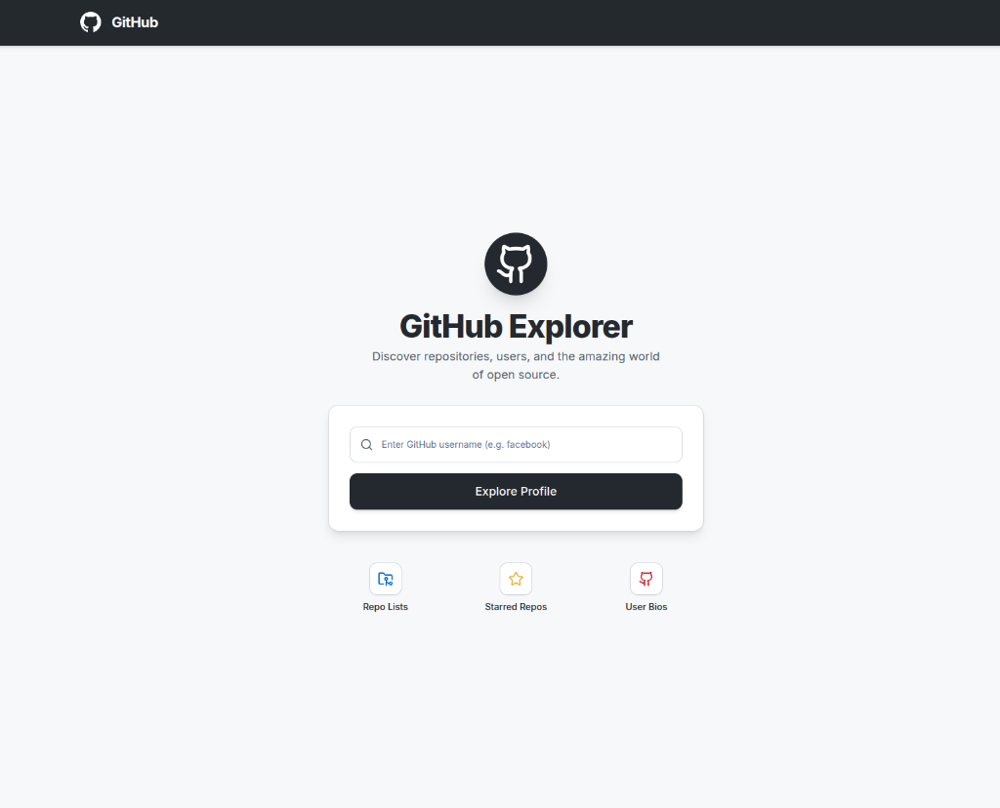
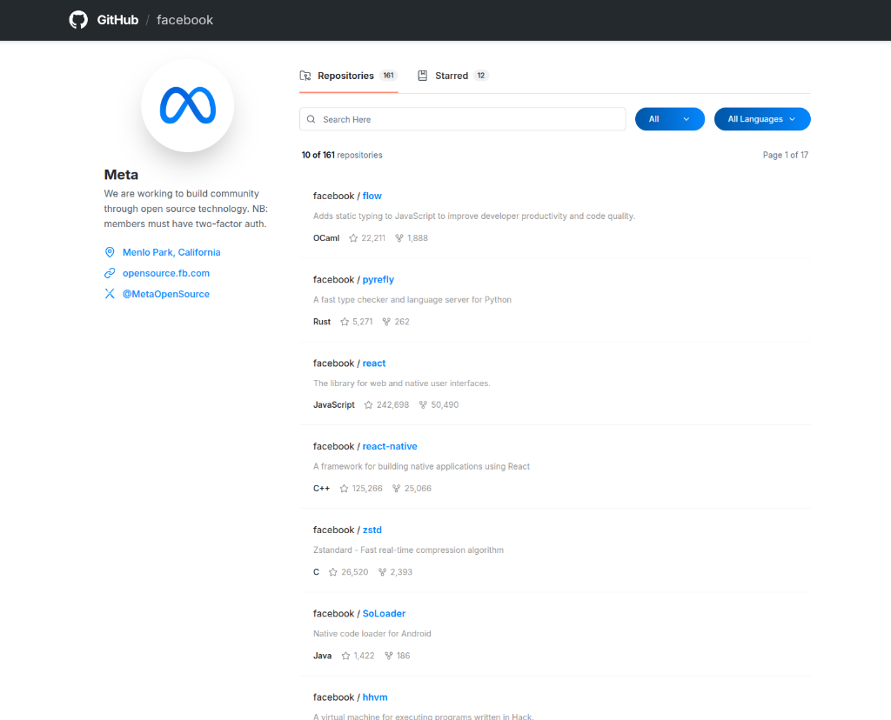

# 🔍 Git Explorer - Magazord Challenge

<p align="center">
  
  
  
  
  
  
</p>

## 📸 Preview

<p align="center">
  
  
</p>

---

## 🇺🇸 English Version

This repository contains the technical solution for the React Developer challenge at Magazord. The application was architected focusing on scalability, runtime performance, and strict maintainability.

### 🚀 Tech Stack & Architecture

- **React 19 + Vite**: Modern runtime with Concurrent Features support and ESM-based bundler for ultra-fast HMR.
- **TypeScript**: Strict static typing to ensure data integrity from the GitHub API.
- **Zustand**: Finite State Machine for global state management, eliminating the overhead of Providers and unnecessary re-renders.
- **TanStack Query (v5)**: Cache persistence layer, asynchronous state management, and stale-while-revalidate logic.
- **TailwindCSS + Shadcn/UI Pattern**: Design System based on Tailwind utilities and local component architecture for maximum performance and transparency.
- **Storybook**: Isolated development environment for technical component documentation.
- **Vitest & RTL**: Unit and integration testing suite focused on user behavior.

### 🎯 Architecture Decisions

#### ⚛️ React (CSR) vs Next.js (SSR/ISR)

We chose **React (Vite)** over Next.js due to the nature of the application:

- **Data Nature:** Since it's a dashboard for highly volatile and user-specific data, SSR would bring a network computational cost (TTFB) without real SEO gain, as the content is dynamic.
- **Runtime Performance:** CSR allows for smoother state transitions (Instant Feedback) after initial load, leveraging browser and React Query caching.

#### 🎨 Shadcn/UI-Philosophy: Customization & Performance

The decision for the **Shadcn/UI Pattern** is based on code transparency and the elimination of "black boxes":

- **Zero Library Bloat:** Instead of installing Shadcn as a dependency, we adopted its **Local Components** architecture. The source code resides directly in `src/components/ui`.
- **Design Token Reuse:** To speed up development, **Tailwind CSS styles and configurations were ported from a previous base project**. This general config file facilitated the immediate implementation of colors, spacing, and custom utilities.
- **Atomicity with CVA:** We use `class-variance-authority` for typed style variants, ensuring optimized CSS generation.
- **UI Ownership:** Full control over each element's behavior, allowing fine-grained design and accessibility adjustments.

#### 📚 Storybook as Technical Documentation

We replaced extensive comments with interactive **Stories**:

- **Isolation Testing:** Each component is developed and tested in a sandbox environment.
- **State Documentation:** Stories visually document all possible states (**Loading**, **Error**, **Empty**, **Interaction**).

#### 🧩 Advanced Composition Pattern

We applied the **Compound Components** pattern to maximize flexibility, decoupling the layout from the component's internal business logic and eliminating prop drilling.

### 🛠️ Challenges & Engineering Solutions

1. **Race Conditions & API Throttling:** Implemented an abstraction layer over `fetch` using React Query to automatically manage cache invalidation and request deduplication.
2. **Multi-Level Filter Logic:** Synchronizing language, type, and text filters was solved via memoized selectors (`useMemo`) to ensure filtering doesn't degrade the frame rate.
3. **Consistency & Design Tokens:** Extended `tailwind.config.js` to exactly reflect Figma's palette and spacing.

### 📖 The Development Journey: The "Haste" Trap

As seen in the commit history, development followed an accelerated pace to deliver the functional core first. However, during the final Phase, adding **Unit Tests and Snapshots** revealed:

- **Hidden Bugs:** Tests uncovered inconsistent behaviors in pagination and filter synchronization.
- **Late Refactoring:** Components had to be adjusted to become "testable", causing rework that TDD would have avoided.
- **The Cost of Speed:** Initial time gains turned into late-stage delays.
  **Lesson Learned:** Haste is an illusion of productivity. Strict standards from "commit zero" are an investment, not a cost.

### 🤖 AI Disclosure

This project used **Artificial Intelligence** as a co-pilot:

- **Consulting & Config:** Optimizing tech settings and development best practices.
- **Agile Development:** Extensive use of _autocomplete_ and constant visual code reviews.
- **Debug & Refactoring:** AI was key in identifying corner cases and fixing complex errors quickly.

### 📱 Mobile vs Desktop Focus

Due to strict time constraints, development efforts were heavily concentrated on the **Desktop** experience to ensure full compliance with the Figma design and technical requirements. While the application is responsive, specialized mobile UX refinements were deferred to prioritize the technical architecture and testing coverage.

### 🧪 Unit Testing

The project features a comprehensive testing suite to ensure reliability and maintainability:

- **Core Technologies:** Powered by **Vitest** for blistering fast execution and **React Testing Library** for behavior-driven component testing.
- **Widespread Coverage:** Includes Unit Tests and Snapshots for:
  - **Atomic & Composite Components:** Ensuring UI consistency and accessibility.
  - **Hooks & State Management:** Validating complex logic in `useGithubData` and `useAppStore`.
  - **Services & Utils:** Rigorous testing of API interactions and helper functions.
- **Quality Assurance:** 15 test files with 78+ passing tests, covering edge cases like API failures, empty states, and complex filter interactions.

### 📂 Project Structure

```text
src/
├── assets/          # Static assets (images, logos)
├── components/      # React components
│   ├── ui/          # Atomic UI components (Shadcn Pattern)
│   └── layout/      # Layout-specific components
├── hooks/           # Custom React hooks (React Query)
├── lib/             # Utility functions and shared instances
├── pages/           # Application views/routes
├── services/        # API communication logic (Axios)
├── store/           # Global state management (Zustand)
├── types/           # TypeScript definitions
└── utils/           # Helper functions
```

### 📦 Setup & Execution

#### Prerequisites

- **Node.js** (v18.x or higher)
- **npm** or **yarn**

#### 1. Installation

Clone the repository and install the dependencies:

```bash
git clone https://github.com/your-username/git-explorer-magazord.git
cd git-explorer-magazord
npm install
```

#### 2. Environment Configuration

The application uses the GitHub API. While optional, it's highly recommended to use a Personal Access Token (PAT) to avoid rate limiting:

1. Copy the `.env.example` to `.env`.
2. Generate a token at [GitHub Settings](https://github.com/settings/tokens).
3. Add it to your `.env` file:

```env
VITE_GITHUB_TOKEN=your_token_here
```

#### 3. Available Commands

| Command             | Description                                                 |
| :------------------ | :---------------------------------------------------------- |
| `npm run dev`       | Starts the development server at `http://localhost:5173`    |
| `npm run build`     | Builds the application for production                       |
| `npm run test`      | Runs the test suite using Vitest                            |
| `npm run test:ui`   | Opens the Vitest UI manager                                 |
| `npm run storybook` | Starts the Storybook environment at `http://localhost:6006` |
| `npm run lint`      | Runs ESLint to check for code issues                        |

---

## 🇧🇷 Versão em Português

Este repositório contém a solução técnica para o desafio de React Developer na Magazord. A aplicação foi arquitetada focando em escalabilidade, performance de runtime e manutenibilidade estrita.

### 🚀 Stack Tecnológica & Arquitetura

- **React 19 + Vite**: Runtime moderno com suporte a Concurrent Features e bundler baseado em ESM nativo para HMR ultra-rápido.
- **TypeScript**: Tipagem estática rigorosa para garantir a integridade dos dados trafegados da API do GitHub.
- **Zustand**: Finite State Machine para gerenciamento de estado global, eliminando o overhead de Providers e re-renders desnecessários.
- **TanStack Query (v5)**: Camada de persistência em cache, gerenciamento de estados assíncronos e lógica de _stale-while-revalidate_.
- **TailwindCSS + Shadcn/UI Pattern**: Design System baseado em utilitários do Tailwind e na arquitetura de componentes locais, garantindo máxima performance e transparência total.
- **Storybook**: Ambiente de desenvolvimento isolado para documentação técnica de componentes.
- **Vitest & RTL**: Suíte de testes unitários e de integração com foco em comportamento de usuário.

### 🎯 Justificativas Técnicas (Architecture Decisions)

#### ⚛️ React (CSR) vs Next.js (SSR/ISR)

Optamos pelo **React (Vite)** em detrimento do Next.js devido à natureza da aplicação:

- **Natureza dos Dados:** Por ser um dashboard de consulta de dados altamente voláteis e específicos por usuário, o SSR traria um custo computacional de rede (TTFB) sem ganho real de SEO.
- **Runtime Performance:** O CSR permite uma transição de estados mais fluida (Instant Feedback) após o carregamento inicial.

#### 🎨 Shadcn/UI-Philosophy: Customização e Performance

A decisão pelo **Shadcn/UI Pattern** fundamenta-se na transparência do código e na eliminação de "caixas pretas":

- **Zero Library Bloat:** Em vez de instalar o Shadcn como uma dependência, adotamos sua arquitetura de **Componentes Locais**. O código-fonte reside diretamente em `src/components/ui`.
- **Reuso de Design Tokens:** Os **estilos e configurações do Tailwind CSS foram portados de um projeto base anterior**, facilitando a implementação imediata de cores e utilitários.
- **Atomicidade com CVA:** utilizamos `class-variance-authority` para gerenciar variantes de estilo de forma tipada.
- **Ownership de UI:** Controle total sobre o comportamento de cada elemento.

#### 📚 Storybook como Documentação Técnica

Substituímos comentários extensos por **Stories** interativas que documentam visualmente todos os estados possíveis (**Loading**, **Error**, **Empty**, **Interaction**).

#### 🧩 Pattern de Composição (Compound Components)

Aplicamos o **Advanced Composition Pattern** para maximizar a flexibilidade e eliminar o _prop drilling_.

### 🛠️ Desafios e Engenharia de Soluções

1. **Race Conditions & API Throttling:** Camada de abstração com React Query para gerenciamento automático de cache e deduplicação de requests.
2. **Lógica de Filtro Multi-Nível:** Sincronização de filtros resolvida através de seletores memorizados (`useMemo`).
3. **Consistency e Design Tokens:** Extensão do `tailwind.config.js` para fidelidade fiel ao Figma.

### 📖 A Jornada de Desenvolvimento: A "Trapaça" da Pressa

Conforme o histórico de commits, a busca por velocidade inicial gerou bugs ocultos e necessidade de refatoração tardia ao implementar **Testes Unitários**.
**Lição Aprendida:** A pressa é uma ilusão. Padrões rigorosos desde o início são um investimento que previne o retrabalho.

### 🤖 Nota sobre o Processo e IA

Este projeto contou com o suporte de **Inteligência Artificial** como ferramenta de co-piloto e consultoria técnica para configurações, desenvolvimento agilizado e debug/refatoração.

### 📱 Foco Mobile vs Desktop

Devido às severas restrições de tempo, o esforço de desenvolvimento foi concentrado na experiência **Desktop** para garantir a total fidelidade ao design do Figma e requisitos técnicos. Embora a aplicação possua responsividade básica, refinamentos específicos de UX mobile foram postergados para priorizar a robustez da arquitetura e a cobertura de testes.

### 🧪 Testes Unitários

O projeto conta com uma suíte de testes abrangente para garantir a confiabilidade e facilidade de manutenção:

- **Tecnologias:** Utilizamos **Vitest** para execução ultra-rápida e **React Testing Library** para testes de componentes baseados em comportamento.
- **Cobertura Geral:** Inclui Testes Unitários e Snapshots para:
  - **Componentes Atômicos e Compostos:** Garantindo consistência visual e acessibilidade.
  - **Hooks e Gerenciamento de Estado:** Validando a lógica complexa de `useGithubData` e `useAppStore`.
  - **Serviços e Utilidades:** Testes rigorosos de chamadas de API e funções auxiliares.
- **Garantia de Qualidade:** 15 arquivos de teste com mais de 78 testes aprovados, cobrindo cenários críticos como falhas de API, estados vazios e interações complexas de filtros.

### 📂 Estrutura do Projeto

```text
src/
├── assets/          # Ativos estáticos (imagens, logos)
├── components/      # Componentes React
│   ├── ui/          # Componentes de UI atômicos (Shadcn Pattern)
│   └── layout/      # Componentes específicos de layout
├── hooks/           # Hooks React customizados (React Query)
├── lib/             # Funções utilitárias e instâncias compartilhadas
├── pages/           # Visualizações/rotas da aplicação
├── services/        # Lógica de comunicação com a API (Axios)
├── store/           # Gerenciamento de estado global (Zustand)
├── types/           # Definições de tipos TypeScript
└── utils/           # Funções auxiliares
```

### 📦 Guia de Setup e Execução

#### Pré-requisitos

- **Node.js** (v18.x ou superior)
- **npm** ou **yarn**

#### 1. Instalação

Clone o repositório e instale as dependências:

```bash
git clone https://github.com/your-username/git-explorer-magazord.git
cd git-explorer-magazord
npm install
```

#### 2. Configuração de Ambiente

A aplicação utiliza a API do GitHub. Embora opcional, é altamente recomendável usar um Personal Access Token (PAT) para evitar limites de taxa (Rate Limit):

1. Copie o arquivo `.env.example` para `.env`.
2. Gere um token em [GitHub Settings](https://github.com/settings/tokens).
3. Adicione-o ao seu arquivo `.env`:

```env
VITE_GITHUB_TOKEN=seu_token_aqui
```

#### 3. Comandos Disponíveis

| Comando             | Descrição                                                       |
| :------------------ | :-------------------------------------------------------------- |
| `npm run dev`       | Inicia o servidor de desenvolvimento em `http://localhost:5173` |
| `npm run build`     | Compila a aplicação para produção                               |
| `npm run test`      | Executa a suíte de testes usando Vitest                         |
| `npm run test:ui`   | Abre a interface visual do Vitest                               |
| `npm run storybook` | Inicia o Storybook em `http://localhost:6006`                   |
| `npm run lint`      | Executa o ESLint para verificar o código                        |

---

## 📜 License / Licença

This project is licensed under the MIT License - see the [LICENSE](LICENSE) file for details.
Este projeto está sob a licença MIT - veja o arquivo [LICENSE](LICENSE) para detalhes.

---

**Developed with focus on technical excellence by Álvaro Bianor.**
**Desenvolvido com foco em excelência técnica por Álvaro Bianor.**
